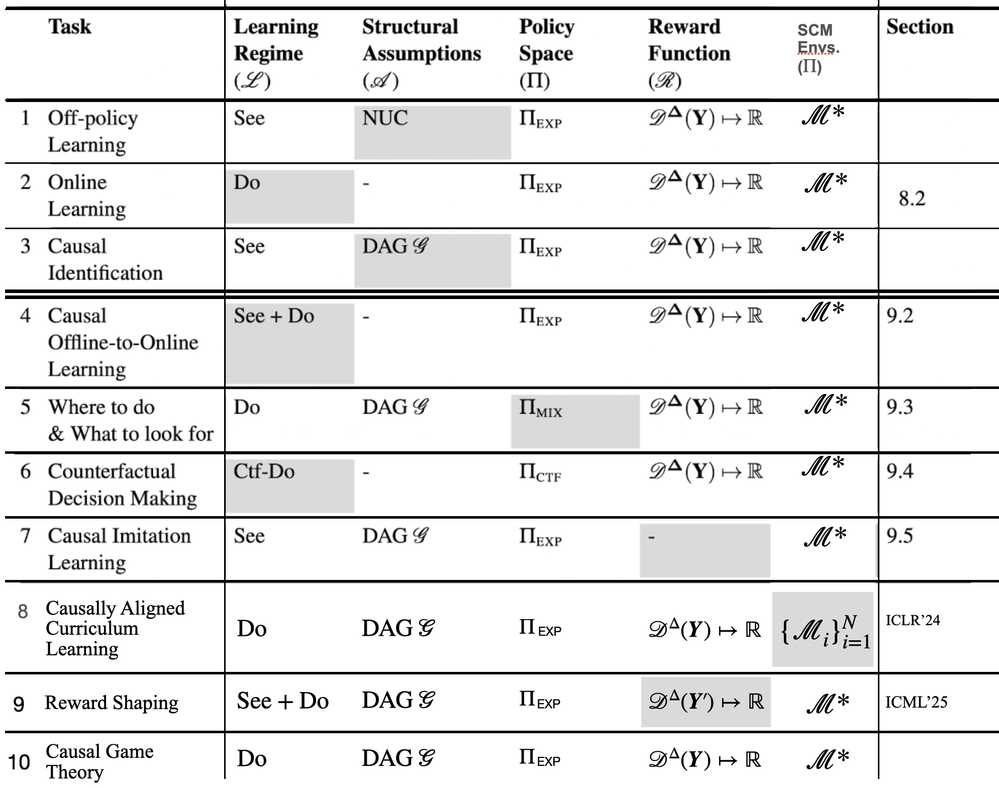

# Causal Reinforcement Learning Baselines

Algorithms, and notebooks for experimenting with Causal Reinforcement Learnining (CRL) on top of [CausalGym](https://github.com/CausalAILab/causalgym). The package exposes causal-aware bandit and sequential algorithms, data-processing utilities, and environment wrappers that embrace Pearl’s Causal Hierarchy (`see`, `do`, `ctf_do`).

## Installation
**Please install `causalgym` first following [this link](https://github.com/CausalAILab/causalgym).**

Then, install this package via,
```bash
pip install -e .
```

The editable install pulls in the dependencies declared in `setup.py` (Gymnasium, Minigrid, MuJoCo Robot Envs, etc.). You will also need the [`causal_gym`](https://github.com/CausalAILab/causalgym) package that defines the environments referenced by the algorithms and wrappers.

## Repository Layout
```
causalrl/
├── causal_rl/                # Python package with algorithms and wrappers
│   ├── algo/
│   │   ├── baselines/        # Standard baselines algorithms (UCB, RCT, IPW) for comparison
│   │   ├── cool/             # Causal Offline to Online Learning (COOL)
│   │   ├── ctf_do/           # Counterfactual Decision Making 
│   │   ├── imitatation/      # (Sequential) Causal Imitation Learning
│   │   ├── reward_shaping/   # Confounding Robust Reward Shaping
│   │   └── where_do/         # Where to Intervene
│   └── wrappers/             # Gymnasium wrappers 
├── examples/                 # Jupyter notebooks of each task
│   ├── baselines/            
│   ├── cool/                 
│   ├── ctf_do/               
│   ├── imitation/            
│   ├── reward_shaping/       
│   └── where_do/             
├── setup.py                  # Packaging metadata and dependency pins
└── README.md                 # (this file)
```

The `causal_rl` package is deliberately thin: algorithms expect an environment that follows the `causal_gym.core.PCH` API (exposes `reset`, `see`, `do`, `ctf_do`, `get_graph`, etc.). The notebooks under `examples/` demonstrate how to apply those algorithms to environments such as windy CartPole, Lava grid world, etc..

## Algorithms & Utilities

Overall, this repository follows the causal decision making tasks defined in [Causal Artificial Intelligence](https://causalai-book.net/) textbook Part III.

| Area | Module | Highlights |
| ---- | ------ | ---------- |
| Counterfactual RL | `causal_rl/algo/ctf_do/` | **`UCBVI`** (`ucbvi.py`) implements the counterfactual variant of UCB Value Iteration (Alg. 26 in the Ctf-UCBVI paper): it keeps optimistic Q tables over `(state, intended_action, executed_action)` tuples, tracks visitation counts, and plans with backward passes that zero out terminal states. **`UCBQ`** (`ucbq.py`) is the model-free analogue that does Q-learning with UCB bonuses. **`CtfUCB`** (`ctfucb.py`) and the vanilla **`UCB`** helper expose contextual bandit-style selection/update routines for counterfactual bandits driven by intuition contexts. |
| Reward shaping & optimistic value bounds | `causal_rl/algo/reward_shaping/` | `calculate_values.py` generates Monte Carlo datasets from windy MiniGrid SCMs, estimates interventional value functions via value iteration, and computes approximate upper bounds using logged data. `q_ucb.py` contains **QUCB_HM** with configurable potential-based shaping modes and conservative confidence bonuses. Constants for reproducibility (wind maps, seeds, episode lengths) live in `constants.py`. |
| Causal imitation & identifiability | `causal_rl/algo/imitatation/` | Implements the sequential `π`-backdoor checks and identifiability tests from Neyman causal models. Utilities include: `collect_expert_trajectories` for harvesting behaviour policy data via `see`, graph parsing helpers (`parse_graph`, `find_sequential_pi_backdoor`), an **`ExpertDataset`** wrapper (`data.py`), and GAN-based policy learners (`gan.py`, `GANPolicy`). The notebook `examples/imitation/test_race_imitation.ipynb` shows how to deploy these pieces on the `RacePCH` environment. |
| Causal optimism for bandits (COOL) | `causal_rl/algo/cool/cool.py` | Provides `cool_mab_ucb`, which clips UCB scores with causal bounds when available, and `mab_ucb_direct_transfer`, a direct experimental transfer baseline that seeds UCB counts with observational `see` data before intervening with `do`. |
| Baselines | `causal_rl/algo/baselines/` | Classical non-causal baselines for comparison: `runRCT` (two-phase randomized trial) and `run_ucb` (vanilla UCB) operating over the same `causal_gym` bandit environments. |
| Environment wrappers | `causal_rl/wrappers/` | Gymnasium-compatible utilities for shaping observations and rewards, e.g. `ClipReward`, `RelativePosition`, `ReacherRewardWrapper`, and `DeployPolicy` (deploy fixed policies over SCM state dictionaries). These wrappers make it easier to plug CausalGym environments into conventional RL pipelines while keeping track of causal semantics. |

## Examples & Research Workflows

Each subdirectory in `examples/` contains a notebook (plus occasional figures) that walks through a causal RL scenario:

- `examples/ctf_do/test_ctf_do_cartpole.ipynb` trains both `UCBVI` and `UCBQ` on a windy CartPole SCM, visualising regret curves and policy snapshots.
- `examples/reward_shaping/test_reward_shaping_{lavacross,robotwalk}.ipynb` benchmarks optimistic shaping strategies on Windy MiniGrid and RobotWalk.
- `examples/cool/test_cool.ipynb` compares causal optimism with direct transfer baselines on confounded bandits.
- `examples/imitation/test_race_imitation.ipynb` applies the sequential identifiability criteria to ensure learned policies generalise under interventions.
- `examples/where_do/test_where_do_bookexamples.ipynb` reproduces the “Where Do” chapter exercises using the `WhereDo` solver in `causal_rl/algo/where_do`.
- `examples/baselines/test_{rct,ucb}.ipynb` provide quick baselines for counterfactual vs. classical bandit training.

The notebooks assume you have `jupyter` installed and that `causal_gym` environments are available. Visual assets (`.png`, `.gif`) illustrate policy trajectories and causal diagrams.

## Quick Start: interacting with a CausalGym environment

```python
import causal_gym as cgym
from causal_gym.core.task import Task, LearningRegime

# 1. Configure the environment to allow see + do + ctf_do
task = Task(learning_regime=LearningRegime.ctf_do)
env = cgym.envs.CartPoleWindPCH(task=task, wind_std=0.05)

observation, info = env.reset(seed=7)

# Observe the behaviour (Level 1: see)
obs, reward, terminated, truncated, info = env.see()
natural_action = info.get("natural_action")

# Intervene with your own policy (Level 2: do)
def greedy_push_right(observation):
    return 1  # action index (env-specific)

obs, reward, terminated, truncated, info = env.do(greedy_push_right)

# Counterfactual action (Level 3: ctf_do)
def counterfactual_policy(observation, natural_action):
    # invert the behaviour policy: push left if it pushed right
    return 0 if natural_action == 1 else natural_action

obs, reward, terminated, truncated, info = env.ctf_do(counterfactual_policy)

env.close()
```

To plug in a causal RL agent, connect its update rule to the same `PCH` interface:

```python
from causal_rl.algo.ctf_do.ucbvi import UCBVI

agent = UCBVI(
    num_states=<discrete_state_count>,  # e.g., grid cells for FrozenLake
    n_actions=env.env.action_space.n,
    horizon=env.env.max_episode_steps,
)

obs, info = env.reset()
state = ...  # map observation/info to the discrete index your agent expects
natural_action = info.get("natural_action", 0)

chosen_action = agent.act(state, natural_action)
next_obs, reward, terminated, truncated, next_info = env.do(lambda *_: chosen_action)
next_state = ...  # convert next_obs/next_info to the same discrete index

agent.update(state, natural_action, chosen_action, reward, next_state)
```

The snippets mirror the interaction patterns documented in `causalgym-readme.md`: `see()` logs observational trajectories, `do()` enforces a policy under intervention, and `ctf_do()` keeps the exogenous noise fixed for counterfactual queries. Algorithms in `causal_rl.algo` expect these methods to be available, so you can swap in any PCH environment (grid worlds, bandits, MuJoCo) with minimal code changes.

## Working with CausalGym

For an exhaustive tour of available environments, graph semantics, and task configuration, read `causalgym-readme.md`. That document explains:

- How SCMs are constructed (endogenous / exogenous variables, structural equations, and causal graphs).
- The meaning of `Task` and `LearningRegime` objects (e.g., `see_do`, `do_only`, `ctf_do`).
- Domain-specific details for each registered environment (CartPole, LunarLander, Highway, Windy MiniGrid, bandits, etc.).

The algorithms and wrappers in this repository build directly on those abstractions—use the same `Task` regime for both the environment and the learning procedure to guarantee that the available data aligns with the assumptions of your causal RL method.

## Contributing

Feel free to open issues or pull requests if you add new causal algorithms, environments, or experiment notebooks. When adding algorithms, favour the PCH interface (`see`, `do`, `ctf_do`) so they remain compatible with the broader CausalGym ecosystem.
