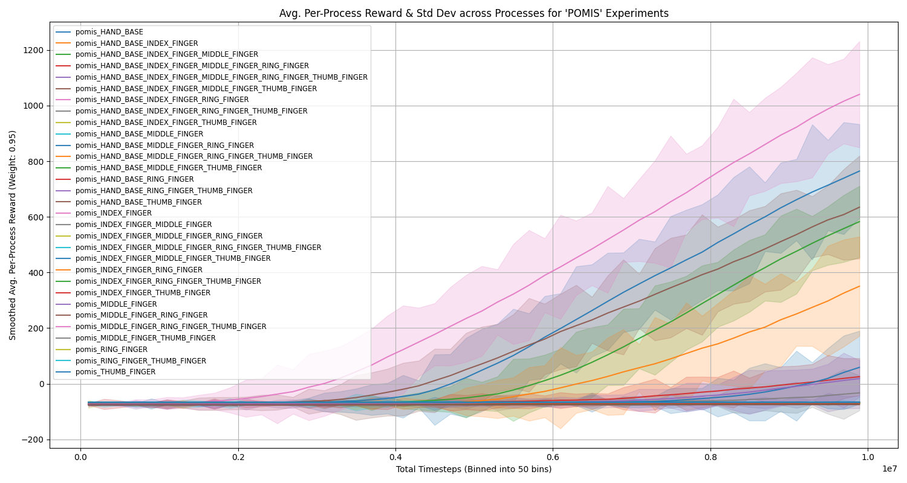

## Requirements

```bash
pip install -r requirements.txt
```

## Training

```bash
# training from scratch
python train_adroit_door.py --num-env-steps 10000000 --log-interval 10 --save-interval 100 --eval-interval 100 --seed 42

# fine-tuning
python train_adroit_door.py --num-env-steps 10000000 --log-interval 10 --save-interval 100 --eval-interval 100 --seed 42 --load-dir trained_models
```

## Visualization

In order to visualize the training curves use 
```bash
python visualize_episode.py --model-path trained_models/pomis/pomis_HAND_BASE.pt --exp-name pomis_HAND_BASE   --video-dir visualized_runs --seed 30
```
To visualize an episode
```bash
python visualize_episode.py --model-path trained_models/pomis/pomis_HAND_BASE_INDEX_FINGER_RING_FINGER.pt --exp-name pomis_HAND_BASE_INDEX_FINGER_RING_FINGER  --video-dir visualized_runs --seed 42
```

## Results


